```mermaid
graph LR
    A[Tworzenie konceptu] --> B[Upload 5-10 wariantów]
    B --> C[Share link z klientem]
    C --> D[Klient komentuje w czasie rzeczywistym]
    D --> E[Poprawki na żywo]
    E --> F[Klient płaci €14.99 za 30 dni]
    F --> G[Finalne pliki do pobrania]
```

# OneDay.run - Customer Value Analysis & Testing Strategy

## 📊 3 Customer Personas & Use Cases

### 1. 🎨 **Anna - Freelance Designer (Warszawa)**

**Scenario**: Anna pracuje z 3-4 klientami miesięcznie nad projektami logo i brandingu.

#### Typowy Workflow


#### Customer Value
- **Czas**: Oszczędza 2-3h tygodniowo (brak emaili "czy to najnowsza wersja?")
- **Pieniądze**: €50-100/projekt więcej (profesjonalny image, szybsze decyzje)
- **Satysfakcja**: 90% redukcja frustracji z wersjonowaniem
- **ROI**: Płaci €30/miesiąc, zarabia dodatkowo €200-400

#### Metryki Sukcesu
- Średni czas od konceptu do akceptacji: **z 5 dni → 2 dni**
- Liczba rewizji: **z 8-10 → 3-4**
- NPS od klientów Anny: **wzrost z 7 → 9**

---

### 2. 👨‍💻 **Tomasz - Tech Lead w Software House (Kraków)**

**Scenario**: Zespół 8 osób, codzienne code reviews, architektura systemów.

#### Typowy Workflow
```javascript
// Poniedziałek - Planning
const sprintPlanning = {
  files: ['architecture.excalidraw', 'tasks.md', 'api-spec.yaml'],
  collaborators: 8,
  duration: '2h',
  outcome: 'Shared understanding'
};

// Wtorek-Czwartek - Development
const dailyReview = {
  files: ['pr-changes.diff', 'test-results.json', 'performance.svg'],
  lifespan: '24h', // Automatic cleanup - no mess!
  value: 'Instant feedback without repo pollution'
};

// Piątek - Demo
const demo = {
  files: ['demo-video.mp4', 'changelog.md', 'next-sprint.svg'],
  extended: true, // €4.99 for weekend access
  sharedWith: 'stakeholders@client.com'
};
```

#### Customer Value
- **Velocity**: +20% szybszy development (mniej meetingów)
- **Quality**: -40% bugów (lepsze code reviews z wizualizacją)
- **Onboarding**: Nowi członkowie produktywni w 3 dni vs 2 tygodnie
- **Compliance**: Zero danych klienta po 24h = zero GDPR problemów

#### Metryki Sukcesu
- Czas do pierwszego PR review: **4h → 30min**
- Liczba "gdzie jest najnowsza wersja?" pytań: **15/tydzień → 0**
- Koszt: €49.99/miesiąc dla teamu vs €500 za Confluence

---

### 3. 🎓 **Marek - Nauczyciel Informatyki (Liceum w Poznaniu)**

**Scenario**: 160 uczniów, projekty AI, ocenianie prac.

#### Typowy Workflow

##### Faza 1: Zadanie Projektowe
```python
# Nauczyciel tworzy szablon projektu
project_template = {
    'instruction': 'zadanie-ai.md',
    'example': 'przyklad-rozwiazania.svg',
    'rubric': 'kryteria-oceny.json',
    'deadline': '24h od rozpoczęcia'
}

# Każdy uczeń klonuje i pracuje
student_work = {
    'id': 'uczen_142',
    'files': [
        'trening-plan.md',
        'dieta-menu.json', 
        'wykresy-mermaid.svg',
        'prezentacja-gamma.pdf'
    ],
    'auto_expire': True  # RODO safe!
}
```

##### Faza 2: AI-Assisted Ocenianie
```javascript
// Automatyczne sprawdzanie przez AI
const gradingAgent = {
  criteria: loadFromTemplate('rubric.json'),
  studentWork: fetchProject(projectId),
  
  analyze: function() {
    return {
      score: calculateScore(),
      feedback: generateFeedback(),
      strengths: identifyStrengths(),
      improvements: suggestImprovements()
    };
  },
  
  timePerStudent: '30 seconds vs 15 minutes manual'
};
```

#### Customer Value
- **Czas**: 40h pracy → 4h (10x szybsze ocenianie)
- **Jakość**: Każdy uczeń dostaje 2-stronicowy feedback (vs 2 zdania)
- **Engagement**: 85% uczniów oddaje projekty (vs 60% emailem)
- **0 zł** za licencje (vs €2000/rok za podobne systemy)

#### Metryki Sukcesu
- Czas oceniania 160 prac: **40h → 4h**
- Jakość feedbacku: **2 zdania → 2 strony A4**
- Satysfakcja uczniów: **6/10 → 8.5/10**

---

## 🎯 Customer Value Proposition Canvas

### **Gains** (Co zyskują)
| Segment | Primary Gain | Secondary Gain | Unexpected Gain |
|---------|--------------|----------------|-----------------|
| Freelancers | Profesjonalny image | Szybsze płatności | Mniej stresu |
| Tech Teams | Velocity +20% | Compliance auto | Better onboarding |
| Educators | Time 10x saved | AI assistance | Student engagement |

### **Pains** (Jakie problemy rozwiązujemy)
```yaml
Przed OneDay.run:
  - "Która wersja jest najnowsza?" (20x dziennie)
  - "Wyślij mi tego PDFa jeszcze raz" (5x dziennie)
  - "Nie mogę otworzyć tego pliku" (3x dziennie)
  - GDPR compliance stress (24/7)
  - Email attachment limits (codziennie)

Po OneDay.run:
  - Jeden link do wszystkiego (1x na projekt)
  - Auto-sync wszędzie (0 pytań)
  - Preview w przeglądarce (100% compatibility)
  - Auto-delete = auto-compliance (0 stresu)
  - Unlimited file size (przez S3)
```

### **Jobs to be Done**
1. **Functional**: Share files + get feedback quickly
2. **Emotional**: Feel professional and organized  
3. **Social**: Impress clients/students with modern tools

---

## 🧪 Automated Testing Strategy

### 1. **E2E Customer Journey Tests**

```javascript
// tests/e2e/freelancer-journey.spec.js
import { test, expect } from '@playwright/test';

test.describe('Freelancer Complete Journey', () => {
  test('Create project → Share → Client feedback → Payment → Download', async ({ page }) => {
    // 1. Create new project
    await page.goto('https://oneday.run');
    await page.click('text=New Project');
    
    // 2. Upload design files
    const files = ['logo-v1.svg', 'logo-v2.svg', 'brand-guide.pdf'];
    for (const file of files) {
      await page.setInputFiles('#file-upload', `./fixtures/${file}`);
      await expect(page.locator(`text=${file}`)).toBeVisible();
    }
    
    // 3. Generate share link
    await page.click('text=Share');
    const shareUrl = await page.inputValue('#share-url');
    expect(shareUrl).toMatch(/oneday\.run\/prj_[\w]+/);
    
    // 4. Simulate client access (new context)
    const clientContext = await browser.newContext();
    const clientPage = await clientContext.newPage();
    await clientPage.goto(shareUrl);
    
    // 5. Client adds comment
    await clientPage.click('[data-testid="comment-button"]');
    await clientPage.fill('#comment-input', 'Love v2, make logo 20% bigger');
    await clientPage.click('text=Send');
    
    // 6. Check real-time sync
    await expect(page.locator('text=Love v2')).toBeVisible({ timeout: 3000 });
    
    // 7. Extend project lifetime
    await page.click('text=Extend Project');
    await page.click('text=30 Days - €14.99');
    
    // Stripe test mode
    await page.fill('[data-stripe="cardNumber"]', '4242424242424242');
    await page.fill('[data-stripe="cardExpiry"]', '12/34');
    await page.fill('[data-stripe="cardCvc"]', '123');
    await page.click('text=Pay €14.99');
    
    // 8. Verify extension
    await expect(page.locator('text=Expires in 30 days')).toBeVisible();
    
    // 9. Download final files
    await page.click('text=Download All');
    const download = await page.waitForEvent('download');
    expect(download.suggestedFilename()).toBe('project.zip');
  });
});
```

### 2. **Performance & Load Testing**

```javascript
// tests/load/k6-scenario.js
import http from 'k6/http';
import { check, sleep } from 'k6';
import { SharedArray } from 'k6/data';

// Simulate 100 concurrent users (typical school class scenario)
export const options = {
  stages: [
    { duration: '30s', target: 20 },  // Ramp up
    { duration: '1m', target: 100 },  // Stay at 100 users
    { duration: '2m', target: 100 },  // Maintain load
    { duration: '30s', target: 0 },   // Ramp down
  ],
  thresholds: {
    http_req_duration: ['p(95)<500'], // 95% requests under 500ms
    http_req_failed: ['rate<0.01'],   // Error rate under 1%
  },
};

const testFiles = new SharedArray('files', function () {
  return [
    { name: 'small.txt', size: 1024 },        // 1KB
    { name: 'medium.pdf', size: 1048576 },    // 1MB
    { name: 'large.svg', size: 10485760 },    // 10MB
  ];
});

export default function () {
  // 1. Create project
  let createRes = http.post('https://api.oneday.run/projects', {
    headers: { 'Content-Type': 'application/json' },
  });
  
  check(createRes, {
    'project created': (r) => r.status === 201,
    'has project id': (r) => r.json('id') !== undefined,
  });
  
  const projectId = createRes.json('id');
  
  // 2. Upload file
  const file = testFiles[Math.floor(Math.random() * testFiles.length)];
  const uploadRes = http.post(
    `https://api.oneday.run/projects/${projectId}/files`,
    { file: http.file(generateFile(file.size), file.name) }
  );
  
  check(uploadRes, {
    'file uploaded': (r) => r.status === 200,
    'upload under 2s': (r) => r.timings.duration < 2000,
  });
  
  // 3. Simulate real-time collaboration
  const ws = new WebSocket(`wss://yjs.oneday.run/${projectId}`);
  
  ws.on('open', () => {
    ws.send(JSON.stringify({
      type: 'awareness',
      user: `user_${__VU}`,
      cursor: { x: Math.random() * 1000, y: Math.random() * 800 }
    }));
  });
  
  sleep(Math.random() * 3); // Random work time
  
  // 4. Download project
  const downloadRes = http.get(
    `https://api.oneday.run/projects/${projectId}/export`
  );
  
  check(downloadRes, {
    'download successful': (r) => r.status === 200,
    'is valid SVG': (r) => r.body.includes('<svg'),
  });
  
  ws.close();
}

function generateFile(size) {
  return 'x'.repeat(size); // Simple file generation
}
```

### 3. **Automated Security Testing**

```bash
#!/bin/bash
# security-test.sh

echo "🔒 Running Security Test Suite"

# 1. OWASP ZAP API Security Scan
docker run -t owasp/zap2docker-stable zap-api-scan.py \
  -t https://api.oneday.run/openapi.json \
  -f openapi \
  -r security-report.html

# 2. SVG XSS Injection Tests
echo "Testing SVG XSS vulnerabilities..."
curl -X POST https://api.oneday.run/projects/test/files \
  -F "file=@malicious-svg-payloads/xss.svg" \
  | grep -q "blocked" && echo "✅ XSS blocked" || echo "❌ XSS vulnerability!"

# 3. File Upload Limits
echo "Testing file upload limits..."
dd if=/dev/zero of=huge.file bs=1M count=101  # 101MB file
curl -X POST https://api.oneday.run/upload \
  -F "file=@huge.file" \
  | grep -q "413" && echo "✅ Size limit enforced" || echo "❌ No size limit!"

# 4. Rate Limiting
echo "Testing rate limits..."
for i in {1..150}; do
  curl -s -o /dev/null -w "%{http_code}" https://api.oneday.run/projects &
done | grep -c "429" | read BLOCKED
[ $BLOCKED -gt 50 ] && echo "✅ Rate limiting works" || echo "❌ No rate limiting!"

# 5. Expiration Testing
PROJECT_ID=$(curl -s -X POST https://api.oneday.run/projects | jq -r .id)
echo "Created project $PROJECT_ID, waiting 24h..."
# In real test, use time manipulation
sleep 86400
curl -s https://api.oneday.run/projects/$PROJECT_ID \
  | grep -q "expired" && echo "✅ Auto-expiration works" || echo "❌ Files not deleted!"
```

### 4. **Continuous Monitoring**

```javascript
// monitoring/synthetic-checks.js
const checks = [
  {
    name: 'Project Creation Flow',
    interval: '5m',
    locations: ['Warsaw', 'Berlin', 'Paris'],
    steps: async (page) => {
      await page.goto('https://oneday.run');
      await measureMetric('page_load', page);
      
      await page.click('text=New Project');
      await measureMetric('project_creation', page);
      
      const projectId = await page.getAttribute('[data-project-id]', 'data-project-id');
      assert(projectId, 'Project ID should exist');
    }
  },
  {
    name: 'File Upload Performance',
    interval: '10m',
    alert: 'slack:#alerts',
    steps: async (page) => {
      const uploadTime = await page.evaluate(async () => {
        const start = performance.now();
        await uploadFile('10mb-test.pdf');
        return performance.now() - start;
      });
      
      assert(uploadTime < 5000, 'Upload should take less than 5s');
      sendMetric('upload_time', uploadTime);
    }
  },
  {
    name: 'Payment Flow',
    interval: '1h',
    critical: true,
    steps: async (page) => {
      // Test with Stripe test cards
      await testPaymentFlow(page, '4242424242424242');
      await testPaymentFlow(page, '4000000000000002'); // Decline
      await testPaymentFlow(page, '4000000000003220'); // 3DS required
    }
  }
];
```

---

## 🚀 Ulepszenia do Implementacji

### Immediate (Week 1)
1. **Magic Link dla nauczycieli** - jeden link dla całej klasy
2. **Bulk export** - pobierz 160 projektów jako ZIP
3. **Template marketplace** - sprzedawaj/kupuj szablony (10% prowizji)

### Short-term (Month 1)
1. **AI Assistant** - "Poukładaj moje pliki" / "Stwórz summary"
2. **Version branching** - jak Git ale wizualnie
3. **Webhook integrations** - Zapier, Make, n8n

### Long-term (Quarter 1)
1. **White-label** - €299/mo dla firm
2. **On-premise** - €2999 jednorazowo
3. **Blockchain timestamps** - dowód istnienia pliku

---

## 📈 Success Metrics Dashboard

```javascript
// Key Metrics to Track
const metrics = {
  acquisition: {
    'Daily New Projects': 'SELECT COUNT(*) FROM projects WHERE DATE(created) = TODAY()',
    'Viral Coefficient': 'shared_projects / total_projects',
    'Organic vs Paid': 'utm_source breakdown'
  },
  
  activation: {
    'Time to First File': 'MEDIAN(first_file_uploaded - account_created)',
    'Setup Completion': 'projects_with_files / total_projects',
    'Collaboration Rate': 'projects_with_2+_users / total'
  },
  
  retention: {
    'D1 Retention': 'users_active_day_1 / cohort_size',
    'D7 Retention': 'users_active_day_7 / cohort_size',
    'D30 Retention': 'users_active_day_30 / cohort_size'
  },
  
  revenue: {
    'Conversion Rate': 'paid_extensions / total_expired_projects',
    'ARPU': 'total_revenue / active_users',
    'LTV': 'ARPU * average_customer_lifetime',
    'CAC': 'marketing_spend / new_customers'
  },
  
  referral: {
    'NPS Score': 'promoters - detractors / total',
    'Share Rate': 'projects_shared / total_projects',
    'Viral Actions': 'invites_sent / active_users'
  }
};
```

## 🎬 Next Steps

1. **A/B Test pricing**: €4.99 vs €6.99 vs €9.99 for 7-day extension
2. **Launch on ProductHunt** z case study od nauczyciela
3. **Partner with Canva EDU** - integracja dla szkół
4. **Build Chrome Extension** - "Save to OneDay.run"